<!-- $theme: gaia -->
#
# Citizen ==FOSS==
#### ***Snowden's toolkit — for the Rest of Us.***
# 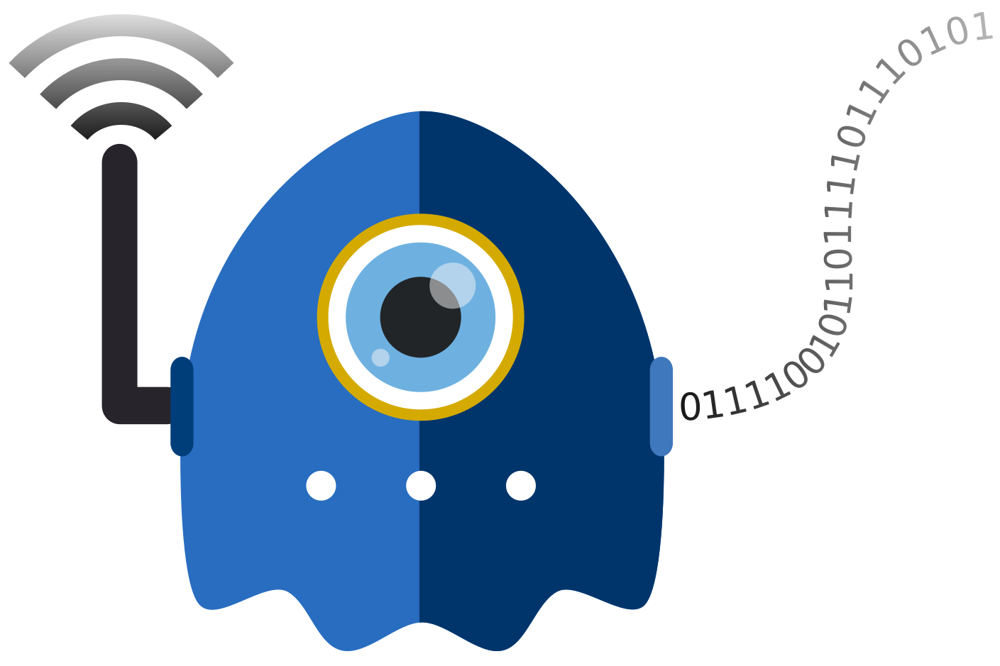
<!-- Digital security icon -->
#### A [Yale Privacy Lab]( https://privacylab.yale.edu) Tech Primer

###### [@YalePrivacyLab](https://twitter.com/YalePrivacyLab) | [privacylab@mastodon.social](https://mastodon.social/@privacylab)

###### 
<!-- Creative Commons Attribution-ShareAlike -->

---
<!-- *template: gaia -->

## Citizen Four (2014):
Film following **Edward Snowden** as he shares NSA spy documents and attempts to flee Hong Kong. "Citizenfour" was one of Snowden's pseudonyms.

## FOSS (English, acronym):
Free and Open Source Software. "Open Source" is often a business term for **Free Software**. The "free" means "freedom" but, usually, it also costs nothing.
_Synonyms:_ Software libre, FLOSS.

---
<!-- *template: invert -->

> ...many people forget – maybe people haven’t seen _Citizen Four_, for example... but if you watch closely in credits, they thank a number of **FOSS** projects, including Debian, Tails, Tor, GnuPG, and so on and so forth.
>
> And that’s because what happened in 2013 **would not have been possible without Free Software**. I did not use Windows machines when I was in my operational phase because I couldn’t trust them.

— Edward Snowden, _[LibrePlanet 2016](http://ioterror.com/items/show/34)_

---
<!-- page_number: true -->

## These Slides are ==Detailed==
<!-- Rick McCallum explaining "every single image" from the Star Wars prequels -->
Grab a copy of the presentation:
[github.com/YalePrivacyLab/citizen-foss](https://github.com/YalePrivacyLab/citizen-foss)

Refer back to it later, read it slowly, &amp; click the links.

* If you don't do everything in the demonstrations
or fall behind, that's okay. **Learn 5 new things**.

* If you don't have a computer/phone, or it's acting
up, make a friend in the room and follow along.

**==Sharing is Caring:==** Please copy, share, and remix!

---
<!-- *template: invert -->
<!-- page_number: false -->

#### ==TL;DR== - Shorter, DIY Version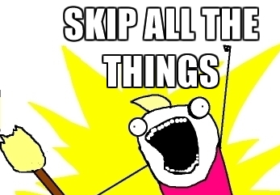
<!-- All The Things meme -->
* <small>Watch these 3 videos on [Privacy](https://www.youtube.com/watch?v=AW7aU3zv-4M), [Free Software](https://www.fsf.org/blogs/rms/20140407-geneva-tedx-talk-free-software-free-society), and [Tor](https://www.youtube.com/watch?v=JWII85UlzKw).</small>

* <small>Try [Jitsi Meet](https://meet.jit.si/), [DuckDuckGo](https://duckduckgo.com/) or [StartPage](https://www.startpage.com/), and [Up1](https://share.riseup.net/).</small>

* <small>Use [Ricochet](https://ricochet.im/) or [Riot](https://riot.im).</small>

* <small>Install [uBlock](https://www.ublock.org/) or [Privacy Badger](https://www.eff.org/privacybadger), and [HTTPS Everywhere](https://www.eff.org/https-everywhere).</small>

* <small>Browse with [Tor Browser](https://www.torproject.org/projects/torbrowser.html.en) and use [OnionShare](https://onionshare.org/).</small>

* <small>Try [Wire](https://wire.com/en/download/) on iOS and Android.</small>

* <small>**Android only:** Install [F-Droid](https://f-droid.org/). Use [Orfox](https://guardianproject.info/apps/orfox/), [Orbot](https://guardianproject.info/apps/orbot/), [Silence](https://silence.im/).</small>

* <small>E-mail via [Tutanota](https://tutanota.com/) or [Protonmail](https://protonmail.com/), or [set up GPG+Enigmail](https://ssd.eff.org/en/searchapi?keys=how+to+pgp).</small>

---
<!-- page_number: true -->

# ==Etherpad== for Live Q &amp; A
#### Let's name a new pad at [pad.riseup.net](https://pad.riseup.net/)
###### <small>...this pad will self-destruct in 30 days.</small>

* This is =="Security by Obscurity"==.
<small>**Do not** type info in the pad you wish to remain private.
If the pad name is guessed or shared, anyone can view it.</small>

* [Riseup.net](https://riseup.net/) hosts awesome services.
<small>Donate if you can, they almost had to shut down in 2016.</small>

<small>Other options: [Riseup .onion Etherpad](http://5jp7xtmox6jyoqd5.onion) (Tor only), [Cryptpad](https://cryptpad.fr)</small>

---
<!-- *template: invert -->
<!-- page_number: false -->

# Why ==Privacy Matters==
#### It's not about "having something to hide"
# [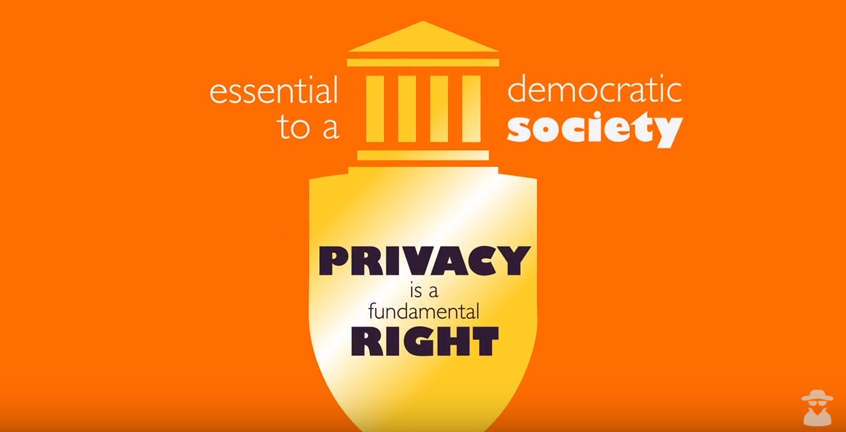](https://www.youtube.com/watch?v=AW7aU3zv-4M)
<!-- CyberSec101 "Why Privacy Matters" -->
###### [Watch on YouTube:arrow_right:](https://www.youtube.com/watch?v=AW7aU3zv-4M) 

---
<!-- page_number: true -->

## Snowden Documents
<!-- Screenshot from Citizenfour -->
#### Major takeaways:

==1.== **The Bad News:**
All popular communication services have been compromised by ==government and corporate surveillance==. <small>Mass data collection, software backdoors &amp; exploits, government information requests, data breaches.</small>

==2.== **The Good News:**
Snowden was able to communicate extremely sensitive information despite this, using a combination of [FOSS](https://en.wikipedia.org/wiki/Free_and_open-source_software) and Operations Security ([OPSEC](https://en.wikipedia.org/wiki/Operations_security)) training.

---
<!-- *template: invert -->
<!-- page_number: true -->

# ==Bad== News
#### Many services still compromised
# [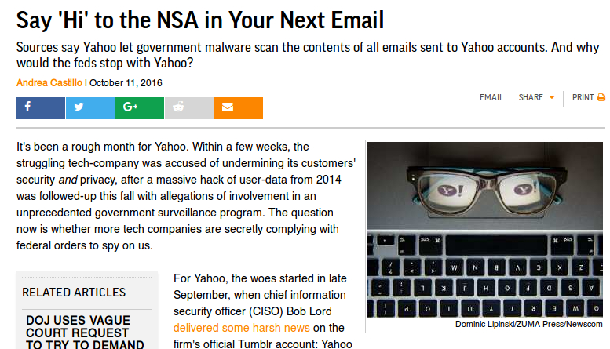](https://reason.com/archives/2016/10/11/more-security-holes-like-yahoos)
<!-- Yahoo! spying mechanism revealed in 2016, Reason.com story -->
###### <small>In 2016, we learned Yahoo! had new spy software for the NSA. At least 1.5 billion accounts were also breached in separate incidents.</small>

---
<!-- page_number: true -->

# ==Good== News
##### More privacy software, easier to use than in 2013
# [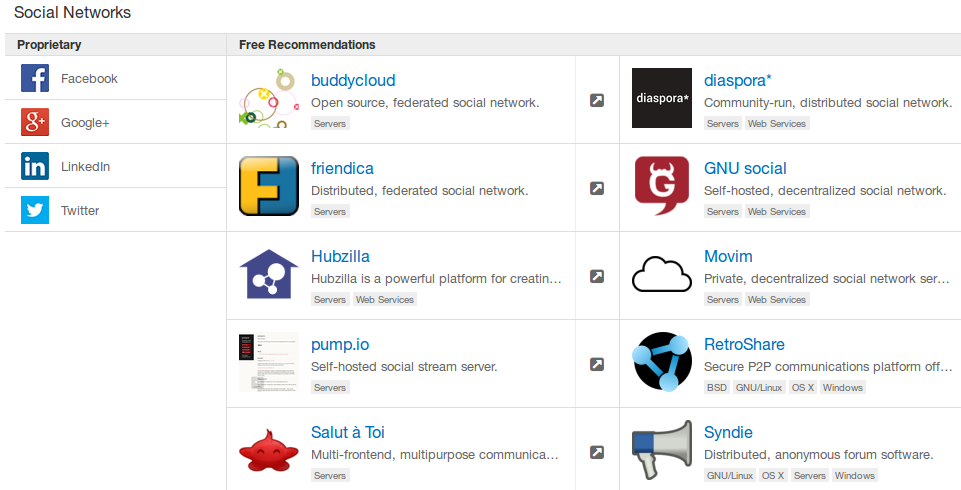](https://prism-break.org/en/all/#social-networks)
<!-- PRISM Break - Social Networks -->
###### <small>A list of alternative social networks from [PRISM Break](https://prism-break.org/en/all/#social-networks).</small>

---

<!-- *template: invert -->

## Guiding Principles:

**1.** Trust is earned. Not bought, decreed, or promised.

**2.** [Free and Open Source Software](https://en.wikipedia.org/wiki/The_Free_Software_Definition) (FOSS) is an essential security requirement (not a guarantee).

**3.** Solutions must be both _libre_ &amp; _gratis_ to reduce friction, encourage sharing, avoid discrimination.

**4.** Advertisements &amp; surveillance go hand-in-glove.

**5.** Data is a [toxic asset](https://www.schneier.com/essays/archives/2016/03/data_is_a_toxic_asse.html).

**6.** Centralization is [dangerous](https://techcrunch.com/2016/11/07/signal-app-maker-rebuts-criticism-of-dev-direction-by-calling-for-more-community-help/).

---
<!-- page_number: true -->

#### What about iPhones, WhatsApp, Facebook?

<!-- Person confused about security in corporate messengers -->
Some U.S. corporations now encrypt some communication, making ==mass surveillance== like [PRISM](https://en.wikipedia.org/wiki/PRISM_(surveillance_program)) difficult.

* <small>Why trust these companies? 
Fool me twice, shame on me.</small>

* <small>On Facebook &amp; WhatsApp, your **metadata** and **social graph** are stored &amp; studied. WhatsApp has a [spy backdoor](https://www.theguardian.com/technology/2019/may/14/whatsapp-spyware-vulnerability-targeted-lawyer-says-attempt-was-desperate).</small>

* <small>Apple knows **who** you talk to, even when they don't know **what** you say to them.</small>

This data can be used for ==targeted surveillance== by [police and intelligence agencies](https://wikileaks.org/podesta-emails/emailid/30593#efmAHtANd).

---
<!-- *template: gaia -->
<!-- page_number: false -->

# Demonstration:
#### Hands‐on with
# [Jitsi Meet](https://meet.jit.si/)

---
<!-- page_number: true -->

# Secure ==Audio/Video Chat==
#### Let's name a new room at [https://meet.jit.si](https://meet.jit.si/)
###### <small>...this chat room will self‐destruct when everyone leaves.</small>
[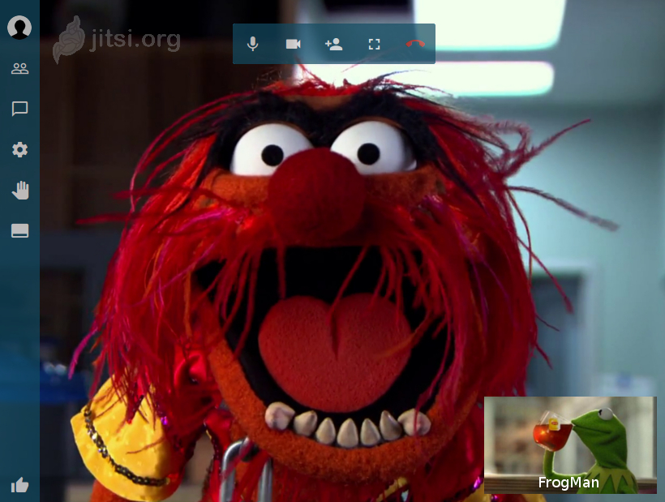](https://meet.jit.si/)
<!-- Muppets using Jitsi Meet -->
* <small>[Peer-to-Peer](https://en.wikipedia.org/wiki/Peer-to-peer)</small>

* <small>Password-protected rooms, no user limit, screen sharing</small>

* <small>Built-in Etherpad, text chat, optional [YouTube streaming](https://jitsi.org/Projects/YouTubeLive)</small>

Other ==WebRTC== options: [appear.in](https://appear.in/) | [Talky](https://talky.io/)

---
<!-- page_number: true -->

## Making ==First Contact==
<!-- Spiderman meme -->
##### Establishing a trusted connection

Privacy tools require ==trust== and a ==shared secret==. That secret could be a username, a URL, a passphrase, or an encryption key.

* <small>Share a secret using tools you learn about today.</small>

* <small>Meeting in person may be the best method.</small>

* <small>[Etherpads](https://pad.riseup.net/), pastebins/imagebins like [Up1](https://pad.riseup.net/), and
"burner" temporary e-mail accounts are good options.</small>

<small>Try to use ==Tor Browser== or ==Orfox== for first contact 
_(we'll cover this later)_.</small>

---

<!-- page_number: true -->

<!-- See No, Hear No, Speak No Evil -->
## Off The Record (==OTR==)
Text chat/IM is very safe, **if configured correctly.**

<small>**Jabber (XMPP)** is the basis for most IM (Google Chat etc.) but you need a trusted service provider. Try [DuckDuckGo XMPP](https://duck.co/blog/post/2/using-pidgin-with-xmpp-jabber), or join [Riseup](https://riseup.net/en/chat), [MayFirst](https://im.mayfirst.org/), or the [Free Software Foundation](https://www.fsf.org/associate/benefits).</small>

<small>Use **[Pidgin](https://pidgin.im/)** (Windows &amp; Linux) and **[Adium](https://adium.im/)** (Mac) with XMPP.
Check the settings and make sure you're not logging chats.</small>

<small>**Set up OTR** for truly private XMPP. [Follow this OTR guide](https://riseup.net/en/otr)</small>

**==Too complicated?==** Try [Ricochet](https://ricochet.im/).

---
<!-- *template: invert -->
<!-- page_number: false -->

# Free Software ==in context==
#### Digital security requires software freedom.
# [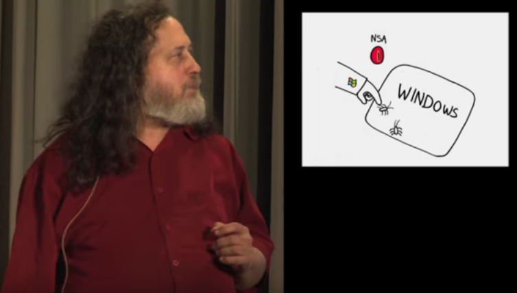](https://www.fsf.org/blogs/rms/20140407-geneva-tedx-talk-free-software-free-society)
<!-- "Why Privacy Matters" -->
###### [Watch on YouTube:arrow_right:](https://www.youtube.com/watch?v=Ag1AKIl_2GM) 

---
<!-- page_number: true -->

## Picking ==Ain't Easy==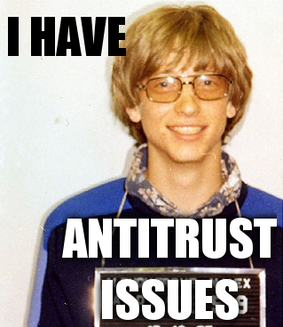
<!-- Bill Gates mugshot -->
Start by eliminating ==proprietary software== and services with ==advertisements==.

* Ads are not only obnoxious, they may [inject malware](http://arstechnica.com/security/2016/12/millions-exposed-to-malvertising-that-hid-attack-code-in-banner-pixels/), even **if** developers [try to avoid it](http://www.pcworld.com/article/2686392/malicious-advertisements-distributed-by-doubleclick-zedo-networks.html).

* Favor [GNU GPL](https://www.gnu.org/copyleft/gpl.html) and other [Free Software licenses](https://www.gnu.org/licenses/license-list.html#SoftwareLicenses).

* Read the [EFF messaging scorecard](https://www.eff.org/secure-messaging-scorecard), Wikipedia,
FOSS community reviews, &amp; online forums.

* Look for [warrant canaries](https://www.eff.org/deeplinks/2016/05/canary-watch-one-year-later) &amp; transparency reports.

* Browse [Tactical Tech](https://tacticaltech.org/), [AlternativeTo](https://alternativeto.net/) &amp; resources listed later.

---
<!-- *template: gaia -->
<!-- page_number: false -->

# Demonstration:
#### Focus on
# Better Browsing

---
<!-- page_number: true -->

## ==Browser War==ning!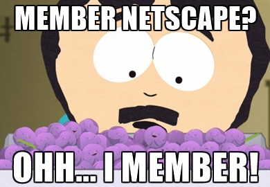
<!-- South Park member berries -->
We'll focus on [Firefox](https://getfirefox.com/) (and [PureBrowser](https://www.pureos.net/) variant). Mozilla [values privacy](https://www.mozilla.org/en-US/privacy/principles/) &amp; has a [solid  record](https://www.mozilla.org/en-US/about/history/).

<small>**Why not Google Chrome?** Most of the following tips will also work on Chrome &amp; [Chromium](https://en.wikipedia.org/wiki/Chromium_(web_browser)) (100% FOSS version). Chrome contains **proprietary** code, has serious privacy issues, and reports back to Google several ways even if you try to opt out.</small>

<small>**Can I trust Chromium?** Maybe. Webcam/microphone [spyware](https://www.theguardian.com/technology/2015/jun/23/google-eavesdropping-tool-installed-computers-without-permission) has been included with Chromium (not just Chrome) in the past, but it has since been removed. You will have to turn off the Google defaults and avoid Google services, however.</small>

---
<!-- page_number: true -->

## Breaking ==Ads==
<!-- Heisenberg sketch from Breaking Bad -->
Try these addons &amp; tweak the settings.
[How to install](http://www.wikihow.com/Enable-Add-Ons) | [How to remove addons](http://www.wikihow.com/Disable-Add-Ons)
* <small>**Essential:** [uBlock](https://www.ublock.org/) or [Privacy Badger](https://www.eff.org/privacybadger), [HTTPS Everywhere](https://www.eff.org/https-everywhere)</small>

* <small>**Recommended:** [DuckDuckGo Plus](https://addons.mozilla.org/en-US/firefox/addon/duckduckgo-for-firefox/), [Decentraleyes](https://addons.mozilla.org/en-US/firefox/addon/decentraleyes/)</small>

* <small>**YourMileageMayVary:** [Privacy Badger](https://www.eff.org/privacybadger), [Disconnect](https://disconnect.me/freeprotection), [LibreJS](https://www.gnu.org/software/librejs/)</small>

* <small>**For the Adventurous:** [NoScript](https://noscript.net/) (turns off all JavaScript)</small>

* <small>**Facebook users:** [FacebookBlocker](https://addons.mozilla.org/en-US/firefox/addon/facebook_blocker/), [Facebook Disconnect
](https://addons.mozilla.org/en-US/firefox/addon/facebook-disconnect-ii/)==Warning:== Facebook is a surveillance network and even
casual communication is carefully studied.</small>

---
<!-- page_number: true -->

<!-- DuckDuckGo logo with sunglasses -->
### Better Search w/ ==DuckDuckGo==

<small>[DontTrack.us](https://donttrack.us/): problems with Google, contrasted with DDG.</small>
<small>[DontBubble.us](https://dontbubble.us/): filter bubbles, which DDG doesn't create.</small>

<small>**!bangs:** Allow you to search other sites. These searches originate from DDG's servers, masking your identity.</small>

`edward snowden !g` Google
`chelsea manning !w` Wikipedia
`richard stallman !yt` YouTube
`debian gnu linux !gi` Google Images

Other options: [Qwant](https://qwant.com) | [Startpage](https://startpage.com/) | [Disconnect](https://search.disconnect.me)

---
<!-- page_number: true -->

#### Mo ==Passwords==, Mo Problems
<!-- Dr. Steve Brule -->
Here are some password strength, storage, and retention strategies.

<small>**Passphrases:** Can be a favorite song lyric, movie quote, or joke. I would also add numbers and special characters:</small>
`Cecil+Harambe4ever`

<small>**Strength:** [General guidelines](https://en.wikipedia.org/wiki/Password_strength#Guidelines_for_strong_passwords) | [Diceware method](https://theintercept.com/2015/03/26/passphrases-can-memorize-attackers-cant-guess/)</small>

<small>**[KeePass](http://keepass.info/)** (Windows/Linux) or **[KeePassX](https://www.keepassx.org/)** (Mac): Organize your passwords in an encrypted database.</small>

<small>**Browser Password Manager:** [In Firefox](https://support.mozilla.org/en-US/kb/use-master-password-protect-stored-logins) | [In Chromium](http://www.ghacks.net/2013/12/04/google-chrome-gets-master-password-protection/)</small>

---
<!-- *template: invert -->
<!-- page_number: false -->

# Onion Routing via ==Tor==
#### Be truly anonymous on the Internet.
# [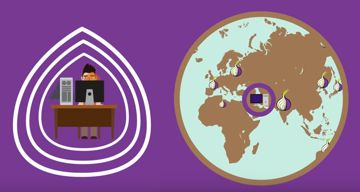](https://www.youtube.com/watch?v=JWII85UlzKw)
<!-- Tor Project -->
###### [Watch on YouTube:arrow_right:](https://www.youtube.com/watch?v=JWII85UlzKw) 

---
<!-- *template: gaia -->
<!-- page_number: false -->

# Demonstration:
#### Try out
# [Tor Browser Bundle](https://www.torproject.org/projects/torbrowser.html.en)

---
<!-- page_number: true -->

## ==Anonymous== Web Browsing
[Download Tor Browser Bundle](https://www.torproject.org/projects/torbrowser.html.en)
<small>It's Firefox, but anonymous! Security plugins pre-installed.</small>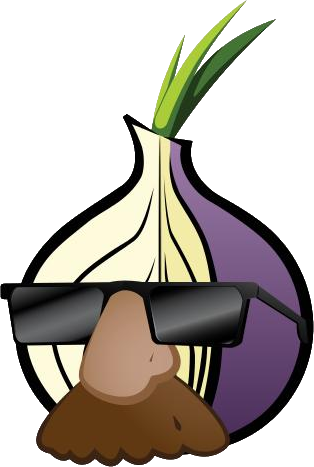
<!-- Pluggable Transports icon -->

**Tor is the standard for anonymity.**
<small>The Tor network thwarts the NSA's best efforts to
break it (we know this [thanks to Snowden](https://edwardsnowden.com/2013/10/04/tor-stinks-presentation/).</small>

* <small>**==However:==** Using Tor is not a magic bullet. Vulnerabilities may occur over time, so  **update often** (TBB will nag you!)</small>

* <small>**TBB Settings:** Go with the defaults. Customization makes you more susceptible  to [browser fingerprinting](https://panopticlick.eff.org/).</small>

* <small>**Bridges:** [Use if Tor is blocked](https://www.torproject.org/docs/bridges#AddTorNotWorks) or you need extra protection.</small>

---
<!-- page_number: true -->
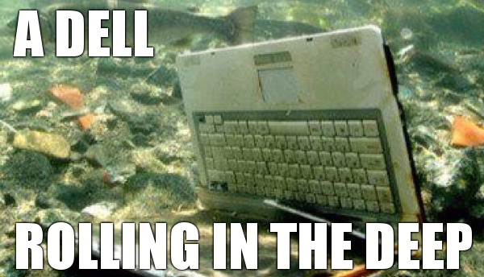
<!-- a Dell underwater -->
### Rolling in the ==Deep==

==Wikileaks== submissions and other anonymous ==.onion== services run on the Tor network.

Use TBB for the "normal" Web **and** the [Deep Web](https://en.wikipedia.org/wiki/Deep_web#Content_types).

**[Onion Sites That Don't Suck](https://github.com/alecmuffett/onion-sites-that-dont-suck)**

[Onionshare](https://onionshare.org): Easy way to share files via .onion URLs.

Other Deep Web networks: [I2P](https://geti2p.net/en/) &amp; [Freenet](https://freenetproject.org/)

<small>**Remember:** True security and anonymity requires hard work and careful actions to get right (==OPSEC==).</small>

---
<!-- page_number: true -->

### "Forget Tor. Just use a ==VPN=="
<small>VPNs route traffic through a (==trusted?==) computer but do not provide the anonymity &amp; security of Tor.  Free (gratis) VPNs may be malicious. Most reputable VPN accounts cost money.</small>
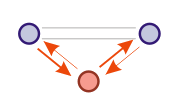
<!-- simplified MITM attack diagram -->
* [What is a VPN good for?](https://ssd.eff.org/en/module/choosing-vpn-thats-right-you)
* Look for a [warrant canary](https://www.canarywatch.org/)!
* You can use [Tor over a VPN](https://www.bestvpn.com/blog/39799/5-best-vpns-when-using-tor/)

<small>**Do your homework before trusting any service.**  Choices:</small>
[Riseup Red](https://riseup.net/en/vpn/vpn-red) (legacy) | [Riseup Black](https://riseup.net/en/vpn)

<small>[Purism VPN](https://shop.puri.sm/shop/purist-vpn-tunnel-beta/) | [Private Internet Access](https://www.privateinternetaccess.com/) | [CyberGhost](https://www.cyberghostvpn.com)</small>

---
<!-- *template: invert -->
<!-- page_number: false -->

# How a ==VPN== Works
#### Watch this before you try any VPN.
# [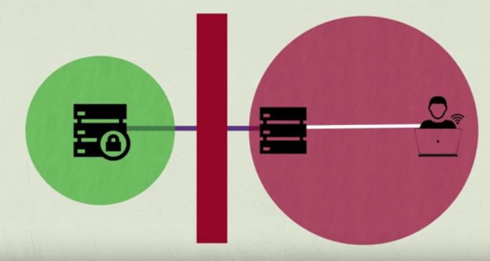](https://www.youtube.com/watch?v=zpUHD-PQuZg)
<!-- How a VPN works -->
###### [Watch on YouTube:arrow_right:](https://www.youtube.com/watch?v=zpUHD-PQuZg) 

---
<!-- page_number: true -->
### ==Sharing== Is Caring
<!-- Creative Commons heart plus the "Home Taping Is Killing Music" logo -->
###### ...but love is a battlefield. Practice [safe sharing](https://en.wikipedia.org/wiki/Anonymous_P2P#List_of_anonymous_P2P_networks_and_clients).

<small>Use [OnionShare](https://onionshare.org) for single files. ==P2P== / ==Bittorrent== requires trade-offs: speed, anonymity, ease-of-use, size of network.</small>

[Tox](https://en.wikipedia.org/wiki/Tox_(protocol)#Clients) | [RetroShare](http://retroshare.net) | [GNUnet](https://en.wikipedia.org/wiki/GNUnet) | [Tribler](https://www.tribler.org/)
<small>
<small>**Remember:** Sharing may run contrary to copyright law in your country.</small>
<small>&bull; Share ==copyleft==, [Creative Commons ShareAlike](https://en.wikipedia.org/wiki/Share-alike) &amp; ==Free Culture== works.</small>
<small>&bull; Bittorrent over Tor is a [bad](https://blog.torproject.org/blog/bittorrent-over-tor-isnt-good-idea) [idea](https://tor.stackexchange.com/questions/64/how-can-bittorrent-traffic-be-anonymized-with-tor#68) &amp; may [de-anonymize](https://hal.inria.fr/file/index/docid/471556/filename/TorBT.pdf) you.</small>
<small>&bull; Set up [blocklists](https://www.iblocklist.com/) to block potentially-malicious peers.</small>
</small>

**Dropbox-like solutions:**
[SparkleShare](https://www.sparkleshare.org/) | [SpiderOak](https://spideroak.com/) <small>_(some parts proprietary)_</small>

---
<!-- *template: gaia -->
<!-- page_number: false -->

# Demonstration:
#### "The Amnesiac Incognito Live System"
# [Tails](https://tails.boum.org)

---
<!-- page_number: true -->

### ==Tails== is the Tor operating system
#### Follow the [Tails Installation Assistant](https://tails.boum.org/install/index.en.html)
* Tails **does not use your hard drive**, or require any hard drive at all.
* Tails boots from USB stick, CD/DVD, or [virtual machine](https://virtualbox.org).[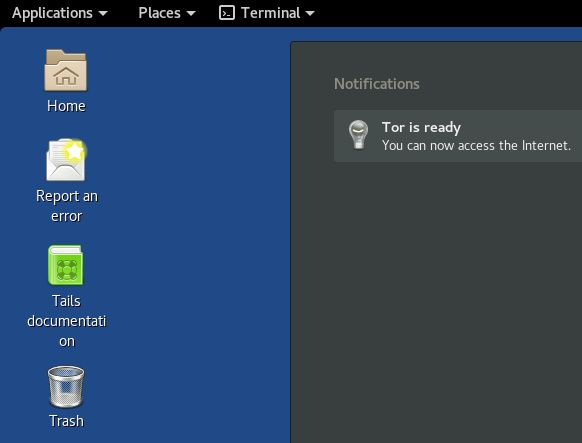](https://www.youtube.com/watch?v=sFtziTT69Go)<!-- TAILS screenshot -->
* You may optionally set up ==persistent storage== for Tails. Otherwise, all files go **&#42;poof&#42;** when you shut down.

Not working? [Try Whonix](https://www.whonix.org/).

---
<!-- page_number: true -->

###### In contrast to Tails...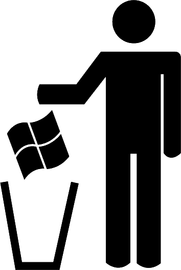<!-- Cropped logo from FSF Bad Windows campaign -->
### ==Windows== can't be trusted.

* <small>Surveillance is [difficult or impossible to turn off](https://lifehacker.com/what-windows-10s-privacy-nightmare-settings-actually-1722267229).</small>

* <small>Long history of [spy backdoors](https://www.schneier.com/blog/archives/2007/12/dual_ec_drbg_ad.html) &amp; special [U.S. military access](http://arstechnica.com/information-technology/2016/12/dod-re-ups-with-microsoft-for-rights-to-total-code-access/).</small>

* <small>Microsoft gathers metrics on [every Windows user](http://www.forbes.com/sites/gordonkelly/2016/01/06/windows-10-spying-secrets-revealed/) (what users type, how long they browse, use apps, play games...)</small>

* <small>==Bitlocker== &amp; [SecureBoot](https://www.fsf.org/campaigns/secure-boot-vs-restricted-boot): Microsoft [stores your encryption key](https://theintercept.com/2015/12/28/recently-bought-a-windows-computer-microsoft-probably-has-your-encryption-key/) after the first time you use Windows Update, and there is a ["skeleton key" backdoor in SecureBoot](http://arstechnica.com/security/2016/08/microsoft-secure-boot-firmware-snafu-leaks-golden-key/) leaked in 2016.</small>

**Macs also contain proprietary software and have [spying](http://trendblog.net/apples-new-os-x-yosemite-spying/), [control](https://www.defectivebydesign.org/apple) mechanisms, &amp; [DRM malware](https://www.defectivebydesign.org/node/1263).**

---
<!-- page_number: true -->

[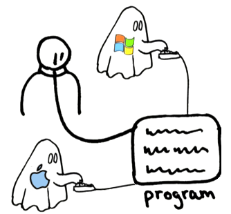](https://www.youtube.com/watch?v=Ag1AKIl_2GM)<!-- Ghosts slide from Richard Stallman's 2014 TEDx talk -->
### Security Is ==Not Proprietary==
Recall [Richard Stallman's TED Talk](https://www.youtube.com/watch?v=Ag1AKIl_2GM).

* <small>Proprietary code is secret, often buggy and/or malicious.</small>

* <small>FOSS is a [basic requirement for security](https://www.schneier.com/crypto-gram/archives/1999/0915.html#OpenSourceandSecurity). Even then it requires "[many eyeballs](https://en.wikipedia.org/wiki/Linus%27s_Law)".</small>

**Fortunately,** there is a lot of high-quality FOSS available, and many users, developers, &amp; security experts worldwide.

---
<!-- page_number: true -->

### What Can the =="Average User"== Do?
**Try [GNU/Linux](https://en.wikipedia.org/wiki/Linux#Desktop)**, a popular &amp; friendly family of FOSS operating systems. ==Tails== is only one member of this family, and may not fit your [threat model](https://alexgaynor.net/2016/jul/29/intro-to-threat-modeling/). 
<!-- Linux kernel's Tux and the GNU Gnu -->

* <small>GNU/Linux is installed on billions of [Web servers](https://w3techs.com/technologies/details/os-linux/all/all), [IoT devices](https://www.ubuntu.com/internet-of-things), supercomputers, TVs, media centers, phones, tablets, &amp; gadgets.</small>

* <small>Not only for [hackers](https://en.wikipedia.org/wiki/Hacker_culture) or bearded white men.  [Many millions](https://en.wikipedia.org/wiki/Linux_adoption#Measuring_desktop_adoption) worldwide use a [GNU/Linux Desktop](https://www.quora.com/When-will-it-be-the-year-of-Linux-on-the-desktop).</small>

* <small>Similar features as [Mac OSX](https://en.wikipedia.org/wiki/Darwin_(operating_system)) due to its [Unix-like](https://en.wikipedia.org/wiki/Unix-like) design.</small>

---
<!-- *template: invert -->
<!-- page_number: false -->

# What is =="Linux"==?
#### "Linux" explained, in four minutes.
# [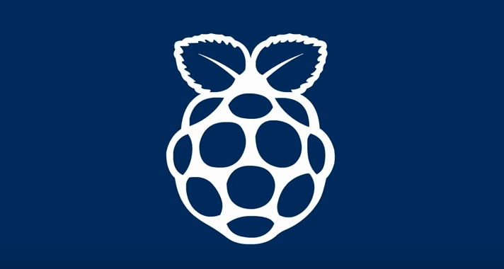](https://www.youtube.com/watch?v=tFFNiMV27VY)
<!-- Linux explained -->
###### [Watch on YouTube:arrow_right:](https://www.youtube.com/watch?v=tFFNiMV27VY) 

---
<!-- page_number: true -->
<!-- Trisquel logo -->
#### The GNU/Linux ==Distro== For You

**Most ==libre==** <small>(no proprietary drivers, codecs, etc.)</small>
[PureOS](https://pureos.net) | [Trisquel](http://trisquel.info) | [gNewSense](http://www.gnewsense.org/) | [Guix](https://www.gnu.org/software/guix/) | [FSF list](https://www.gnu.org/distros/free-distros.html)

**Very ==popular==** <small>(big community == good support)</small>
[Debian](http://debian.org) | [Ubuntu](http://ubuntu.com/) | [Linux Mint](http://linuxmint.com/) | [Fedora](https://fedoraproject.org)

**Some "==favorites=="** <small>(list changes frequently)</small>
[Ubuntu MATE](https://ubuntu-mate.org) | [Xubuntu](http://xubuntu.org/) | [Korora](https://kororaproject.org/) | [Elementary](http://elementaryos.org)

**==Lightweight==** <small>(for aging computers)</small> [wattOS](http://planetwatt.com/new/) | [Bunsenlabs](https://www.bunsenlabs.org/)
**Very ==secure==** <small>(not for n00bs)</small> [Qubes](https://qubes-os.org/) | [Subgraph](https://subgraph.com/)

<small>[DistroWatch](http://distrowatch.org) | [FSF common systems list](https://www.gnu.org/distros/common-distros.html) (mainly [Unix-like](https://en.wikipedia.org/wiki/Unix-like))</small>

---
<!-- page_number: true -->

### What about my phone/tablet?<!-- Tux as Neo from The Matrix -->
Let's concentrate on ==Android== variants, which are based upon GNU/Linux.

**Stock Android is insecure.** It has [dodgy](http://www.eweek.com/mobile/gooligans-malware-infects-more-than-1.3-million-devices-researchers-say.html) proprietary apps from ==Google==, the ==vendor== (e.g. Samsung), &amp; ==ISP== (e.g. AT&amp;T). It may have [backdoors for spies](http://www.consumerreports.org/privacy/what-you-need-to-know-about-phones-secretly-sending-data-china/).

**Some Android devices are  restrictive.** Your current device may not allow you to "free" it.  If so, ==keep freedom in mind== for your next device.

**iPhone/iPads are [restrictive](https://www.defectivebydesign.org/blog/1256)**, with many pitfalls for security &amp; freedom. If you must use one, [jailbreak](https://en.wikipedia.org/wiki/IOS_jailbreaking).

---
<!-- *template: invert -->
<!-- page_number: true -->

### There is a world beyond Google.
### [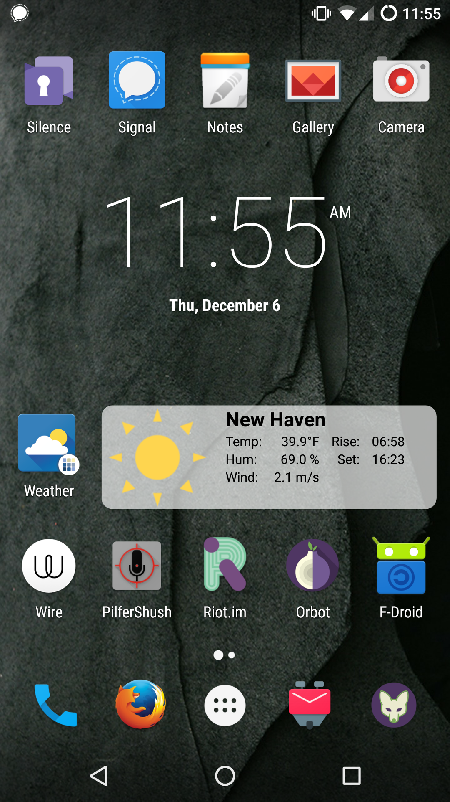](https://lineageos.org)
<!-- screenshot of AOSP with no Google services, F-Droid, Orbot, etc. -->

---
<!-- page_number: true -->

<!-- ROM Spaceknight from Marvel Comics -->
## Finding a ==ROM==
ROMs in the ==modding== community are loosely equivalent to distros / ==firmware==.

* **[Lineage](http://lineageos.org) or [OmniROM](https://omnirom.org/)** - Installs on many devices.

* **[XDA-Developers Forum](http://forum.xda-developers.com/)** - More alternatives.

#### Non-Android GNU/Linux Devices

* **[Librem 5](https://puri.sm/products/librem-5/)** - Secure phone coming in 2019.

* **["New Wave" GNU/Linux Phones](https://www.linux.com/blog/2017/9/librem-5-leads-new-wave-open-source-mobile-linux-contenders)** - More options.

---
<!-- page_number: true -->

<!-- Alice in Wonderland unlocking a tiny door. "Down the Rabbit Hole" is the expression I want here, but I can't find a decent image of that :/ -->
## Got ==r00t==?
==rooting== a device means getting ==superuser== / ==sysadmin== access. It's a Unix-y term for [full control of a system](https://en.wikipedia.org/wiki/Superuser). 

**With Great Power Comes Great Responsibility.**
Root ==**may**== be needed ==**temporarily**== to free your device. ROMs usually allow you to [turn it on and off](https://web.archive.org/web/20160522205137/http://www.cyanogenmod.org/blog/security-and-you).

**Unlocked Bootloader:** If this is a step in the [ROM installation process](https://web.archive.org/web/20161224205610/https://wiki.cyanogenmod.org/w/Install_CM_for_angler#Unlocking_the_bootloader), you should lock it afterward.

**It's all part of the fun!** Back up your files, follow instructions, and use a "test device" if possible.

---
<!-- *template: gaia -->
<!-- page_number: false -->

# Demonstration:
#### Getting started with
# Apps

---
<!-- page_number: true -->

<!-- F-Droid logo -->
<small>**1.** [Install **F-Droid**](http://f-droid.org/), the FOSS app store for Android. You may have to "[allow unknown sources](https://developer.android.com/distribute/tools/open-distribution.html)".</small>

<small>**2.** [Add the **Guardian Project** repository](https://guardianproject.info/fdroid/) in F-Droid. GP offers privacy apps like [ObscuraCam](https://guardianproject.info/apps/obscuracam/).</small>

<small>**3.** Install [**Orbot**](https://guardianproject.info/apps/orbot/) &amp; [**Orfox**](https://guardianproject.info/apps/orfox/), Tor and Tor Browser for Android.</small>

<small>**4.** Try [**Silence**](https://silence.im/) &amp; [**Wire**](https://wire.com/en/download/). Silence enables encrypted SMS/text. Wire is a full-featured text and voice chat app like Signal.</small>

<small>**5.** Search for other [**FOSS apps**](https://f-droid.org/repository/browse/), like [ad blockers](https://f-droid.org/repository/browse/?fdfilter=adblock&fdid=org.adblockplus.android).</small>

<small>**5.** Look for other [E2EE](https://en.wikipedia.org/wiki/End-to-end_encryption) apps around the Web like **[Signal](https://signal.org)**.</small>

---
<!-- page_number: true -->

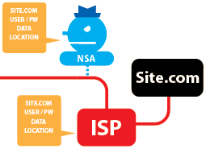<!-- Section of Tor and HTTPS diagram from https://www.eff.org/pages/tor-and-https -->
## What about my ==Router==?
Your gateway to the Internet may be insecure. Default router / modem firmware [has](https://en.wikipedia.org/wiki/NSA_ANT_catalog) [many](https://www.schneier.com/blog/archives/2014/01/jetplow_nsa_exp.html) [vulnerabilities](https://en.wikipedia.org/wiki/Dual_EC_DRBG#Software_and_hardware_which_contained_the_possible_backdoor) and is [often](https://en.wikipedia.org/wiki/Equation_Group) [under](https://en.wikipedia.org/wiki/The_Shadow_Brokers) [attack](http://www.techrepublic.com/article/massive-ddos-attacks-up-138-from-last-year-says-akamai-report/).

* **[DD-WRT](https://www.dd-wrt.com/site/)** - FOSS firmware for many routers.

* **[Tomato](https://en.wikipedia.org/wiki/Tomato_(firmware))** - A family of FOSS firmware mods.

* **[OpenWRT](https://openwrt.org/)** - More like a distro for your router.

**[DNS](https://en.wikipedia.org/wiki/Domain_Name_System) vulnerabilities** - [OpenNic](https://www.opennicproject.org/) is an alternative DNS provider that routes around censorship and protects your network from [DNS hijacking](https://gnunet.org/sites/default/files/mcb-en.pdf).

---
<!-- *template: invert -->
<!-- page_number: false -->

# Intro to ==Encryption==
#### How math can keep us secure.
# [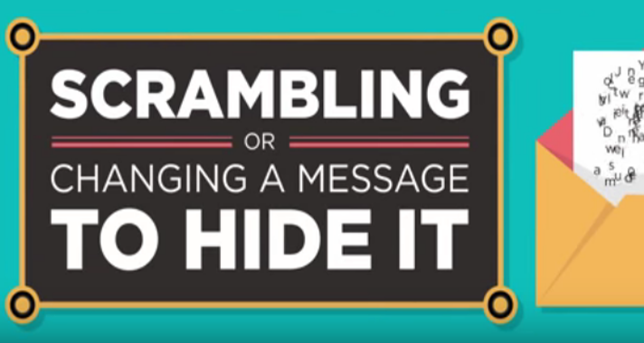](https://www.youtube.com/watch?v=ZghMPWGXexs)
<!-- Encryption -->
###### [Watch on YouTube:arrow_right:](https://www.youtube.com/watch?v=ZghMPWGXexs) 

---
<!-- page_number: true -->

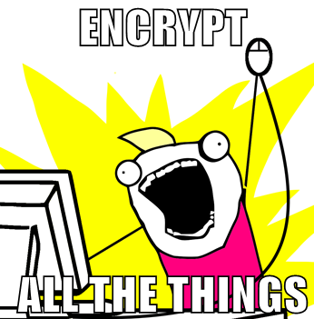<!-- All The Things meme, again -->
### Encrypt Your ==Storage==
<small>**Encryption works**, but is only as good as the implementation. FBI had a  hard time [getting into that iPhone](https://theintercept.com/2016/03/28/fbi-got-into-san-bernardino-killers-iphone-without-apples-help/). If they tried, Apple could get in more easily.</small>

* <small>[Android](https://source.android.com/security/encryption/full-disk.html) &amp; variants also have [full-disk encryption](http://www.howtogeek.com/141953/how-to-encrypt-your-android-phone-and-why-you-might-want-to/).</small>

* <small>[VeraCrypt](https://www.veracrypt.fr/en/Home.html) is great for Desktop OS's and USB flash drives.</small>

* <small>Full-disk &amp; [home directory](https://askubuntu.com/questions/37/when-installing-im-given-the-option-of-encrypting-my-home-folder-what-does-t) encryption are [easy checkbox choices](https://www.eff.org/deeplinks/2012/11/privacy-ubuntu-1210-full-disk-encryption) when installing all major GNU/Linux distros.</small>
 
* <small>[More GNU/Linux options](https://www.cyberciti.biz/hardware/howto-linux-hard-disk-encryption-with-luks-cryptsetup-command/). Use [Cryptkeeper](http://www.makeuseof.com/tag/encrypt-protect-computer-files-cryptkeeper-linux/) for  folders.</small>

Above all, **don't trust cloud storage like [Dropbox](https://www.theguardian.com/technology/2016/aug/31/dropbox-hack-passwords-68m-data-breach).**

---
<!-- page_number: true -->

<!-- Hillary Clinton on her Blackberry -->
### Plugging the ==E-mail== hole
Expect large, consistent ==data breaches==.

**Major e-mail providers can't be trusted**.
<small>Even years after the Snowden disclosures, Yahoo! created [new NSA wiretaps](https://theintercept.com/2016/10/04/delete-your-yahoo-account/) and leaked [500 million accounts](http://www.nytimes.com/2016/09/23/technology/yahoo-hackers.html). Google [actively studies](https://www.scribd.com/document/171461409/Google-Gmail-Litigation) e-mails, even [spying as you type](http://www.nytimes.com/2016/09/23/technology/yahoo-hackers.html).</small>

**E-mail is a two-way street.**
<small>Messages have to be private ==on both ends==.  Your buddy @gmail.com is giving the conversation to Google.</small>

---
<!-- page_number: true -->

[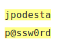](https://wikileaks.org/podesta-emails/emailid/22335#efmABbABs)<!-- One of John Podesta's insecure passwords shared via e-mail -->
### ==E-mail== is an easy target

* E-mail is often sent and received insecurely, yet users treat it as a secure channel.

* Inboxes are utilized for personal data storage.

* Weak passwords &amp; password sharing is common, especially under work pressure.

* Junk/spam filters play a [cat-and-mouse game](http://www.davidreiley.com/papers/SpamEconomics.pdf).

* [Phishing scams](https://theconversation.com/spearphishing-roiled-the-presidential-campaign-heres-how-to-protect-yourself-68274) are increasingly-sophisticated.

**Don't assume spies are too cool for phishing.** [Malware sent via e-mail](https://theintercept.com/document/2014/03/12/nsa-phishing-tactics-man-middle-attacks/) is a common tactic.

---
<!-- *template: gaia -->
<!-- page_number: false -->

# Demonstration:
#### Up and running with
# Encrypted E-mail

---
<!-- page_number: true -->

<!-- Tutanota logo -->
### The Road to Private ==Webmail==
###### Create a [Tutanota](https://tutanota.com/) account. Use ==Tor Browser== if you can.

* <small>**Pros:** Very easy to use, encrypts ==metadata== (subject, sender, recipient) as well as ==message content==. Android &amp; iOS [apps](https://github.com/tutao/tutanota/releases).</small>
* <small>**Cons:** Encryption only to other Tutanota addresses. Can't download your mail locally via ==POP== or ==IMAP==.</small>
* <small>[Protonmail](https://protonmail.com/) is a similar service, with encrypted, [password-protected e-mail](https://protonmail.com/support/knowledge-base/encrypt-for-outside-users/) to non-Protonmail users.</small>

<small>Tutanota &amp; Protonmail are **not as flexible or popular as GPG**. They work best if everyone uses the same webmail provider.</small>

---
<!-- *template: invert -->
<!-- page_number: false -->

# GPG guide by ==anon108==
##### Uploaded Jan. 6, 2013. Can you name the voice?
# [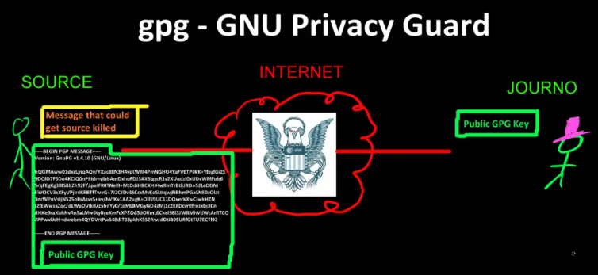](https://vimeo.com/56881481)
<!-- "anon108" video uploaded on 2013-01-06 by Edward Snowden, presumably for Glenn Greenwald (?) to watch -->
###### [Watch on Vimeo:arrow_right:](https://vimeo.com/56881481) 

---
<!-- page_number: true -->

<!-- Mozilla Thunderbird logo -->
#### You Down with ==PGP==? ***Yeah, GnuPG!***

<small>We say "GPG" because we're using the **==G==NU ==P==rivacy ==G==uard** implementation of **==P==retty ==G==ood ==P==rivacy**.</small>

**[Download Thunderbird:arrow_right:](https://www.mozilla.org/en-US/thunderbird/)**

**Follow the EFF's guide for your operating system:**

**[GNU/Linux](https://ssd.eff.org/en/module/how-use-pgp-linux)** | **[MacOS](https://ssd.eff.org/en/module/how-use-pgp-mac-os-x)** | **[Windows](https://ssd.eff.org/en/module/how-use-pgp-windows)**

<small>**E-mail Hosts:** Try [Riseup](https://user.riseup.net/forms/new_user/first) or [Mailfence](http://mailfence.com/).
Mailfence has easy Gmail, Yahoo!, &amp; Office365 import, quick [GPG setup](https://www.mailfence.com/c/mailfence/more/crypto.jsp), and has [calendar / document sharing](https://blog.mailfence.com/secure-document-sharing/). Some features require paid account.</small>

---
<!-- page_number: true -->

## Avoid ==Web== Publishing Traps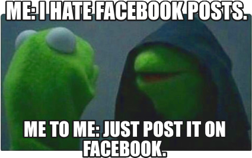<!-- Evil Kermit meme -->

<small>Sharing isn't just about conversations.
The Web is for publishing _World Wide_.

**Avoid [walled gardens](https://en.wikipedia.org/wiki/Closed_platform)** with total surveillance like Facebook. Replace them with [federated social networks](https://prism-break.org/en/all/#social-networks).

<small>**Replace Facebook:** [diaspora*](https://diasporafoundation.org/), [Friendica](http://friendi.ca/) | **Twitter:** [Mastodon](https://mastodon.social), [GNU Social](https://gnu.io/social/)</small>

<small>Find trustworthy hosting for **[Websites](https://drupal.org), [Blogs](https://wordpress.org), [Wikis](https://mediawiki.org) &amp; [Classes](https://moodle.org)**.</small>
* <small>[MayFirst](https://mayfirst.org) is great for activists and has [defense from DDoS](https://deflect.ca/).</small>

* <small>[Whitelist Tor visitors](https://support.cloudflare.com/hc/en-us/articles/201897700-Whitelisting-Cloudflare-IP-addresses) if you use CloudFlare.</small>

* <small>Set up ==SSL/TLS== via [Let's Encrypt](https://letsencrypt.org/) to protect your users.</small>

---
<!-- *template: invert -->
<!-- page_number: false -->

### Secure Comms Strategy<!-- The portable cone of silence from Get Smart -->
#### Make a plan and stick to it.
* The **What**: Choose a few crypto, sharing, &amp; publishing tools.
* The **How**: Try these tools, figure out how they work.
* The **Where**: Find safe places to share secrets, on &amp; offline.
* The **When**: Describe scenarios when you will use each tool.
* The **Why**: State clear reasons to use each tool.
* The **Who**: Identify "experts" who can help &amp; teach others.

**The Only Constant Is Change!** Try new software, keep up on tech news &amp; potential threats, and re-evaluate over time.

---
<!-- page_number: false -->

## Resources[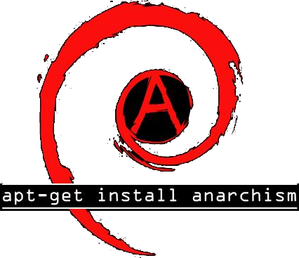](https://debian.org)
<!-- Debian apt-get install anarchism -->
* Free Software Foundation: [fsf.org](https://fsf.org/)
* Tor Project: [torproject.org](https://torproject.org/)
* Electronic Frontier Foundation: [eff.org](https://eff.org/)
* [Digital Security For Journalists](https://www.gitbook.com/book/susanemcg/digital-security-for-journalists/details)

[Cryptoparty](http://www.cryptoparty.in) | [Riseup](https://help.riseup.net/en/security) | [Tactical Tech](https://tacticaltech.org/security-box) | [PRISM Break](https://prism-break.org)

[MayFirst](https://support.mayfirst.org/wiki/how-to) | [Encryption Works](https://freedom.press/encryption-works) | [Reset The Net](https://pack.resetthenet.org/)

[Digital First Aid](https://www.digitaldefenders.org/digitalfirstaid/) | [H-Node](https://h-node.org) | [DRM-Free](https://www.defectivebydesign.org/guide)

**[Digital Security Helpline](https://www.accessnow.org/help)**: 24/7 multilingual support

**[Xnet](https://xnet-x.net/contactanos-para/publicaciones/)**: grandes recursos en español

---
<!-- page_number: false -->

<!-- Meditating Gnu -->
## Sources

* <small>[Yale Privacy Lab ghost](https://privacylab.yale.edu), Sean O'Brien, [CC BY-SA 4.0](http://creativecommons.org/licenses/by-sa/4.0/) (contains elements from [EmojiTwo](https://emojitwo.github.io/), [CC BY 4.0](http://creativecommons.org/licenses/by/4.0/), and [Wifi by SimpleIcon](http://www.flaticon.com/free-icon/wifi-medium-signal-symbol_34143), [CC BY 3.0](http://creativecommons.org/licenses/by/3.0/))</small>

* <small>[Rick McCallum describing *Star Wars: Episode I*](https://www.youtube.com/watch?v=qvc9_GDoWI4)</small>

* <small>["All the Things" meme](http://knowyourmeme.com/memes/x-all-the-y), based on Allie Brosh comic</small>

* <small>Screenshot from ["Why Privacy Matters" video](https://www.youtube.com/watch?v=9I7AGRUPIIE), CyberSec101</small>

* <small>Edward Snowden and Glenn Greenwald from [*Citizenfour*](https://en.wikipedia.org/wiki/Citizenfour)</small>

* <small>[Story on Yahoo! data breach](https://reason.com/archives/2016/10/11/more-security-holes-like-yahoos), Reason.com</small>

* <small>Screenshot of [PRISM Break](https://prism-break.org/en/all/#social-networks), [GNU GPLv3](https://github.com/nylira/prism-break/blob/master/LICENSE.md)</small>

* <small>[Confused student](http://www.flaticon.com/free-icon/student-with-doubts-on-class_43320) &amp; [WhatsApp icon](http://www.flaticon.com/free-icon/student-with-doubts-on-class_43320), Freepik, [Flaticon Basic](http://file000.flaticon.com/downloads/license/license.pdf)</small>

* <small>[Facebook Messenger icon](http://www.flaticon.com/free-icon/messenger_134938), Madebyoliver, [Flaticon Basic](http://file000.flaticon.com/downloads/license/license.pdf)</small>

---
<!-- page_number: false -->

### Sources (continued)

* <small>[Apple icon](http://www.flaticon.com/free-icon/apple_179309), Pixel Buddha, [Flaticon Basic](http://file000.flaticon.com/downloads/license/license.pdf)</small>

* <small>Screenshot of [Jitsi Meet](https://meet.jit.si) with Animal and Kermit from *The Muppets*</small>

* <small>[Spider-Man meme](http://knowyourmeme.com/memes/60s-spider-man), based on 60's animated series</small>

* <small>["See no, Hear no, Speak no" penguins](http://truckitos.es.tl/Galeria/kat-1-1.htm), Crystal Icons by Everaldo Coelho, [GNU LGPLv2 or later](http://www.gnu.org/copyleft/lgpl.html)</small>

* <small>Screenshot from [Richard Stallman TEDx talk](https://www.fsf.org/blogs/rms/20140407-geneva-tedx-talk-free-software-free-society), [CC BY-ND 3.0](https://creativecommons.org/licenses/by-nd/3.0/)</small>

* <small>[Mugshot of Bill Gates](https://commons.wikimedia.org/wiki/File:Bill_Gates_mugshot.png), public domain</small>

* <small>Randy Marsh and "member berries" from *South Park*</small>

* <small>Sketch of "Heisenberg" from *Breaking Bad*</small>

* <small>[DDG logo](https://commons.wikimedia.org/wiki/File:DuckDuckGo_logo_and_wordmark_(2014-present).svg), DuckDuckGo, Inc., [GNU GPLv1 or later](https://github.com/duckduckgo/community-platform/blob/master/LICENSE) or [Artistic License](http://www.perlfoundation.org/artistic_license_1_0)</small>

---
<!-- page_number: false -->

### Sources (continued)

* <small>John C. Reilly from *Check It Out! with Dr. Steve Brule*</small>

* <small>Screenshot from ["Tor Animation" video](https://www.youtube.com/watch?v=JWII85UlzKw), Tor Project, [CC BY 3.0 US](https://creativecommons.org/licenses/by/3.0/us/)</small>

* <small>[Pluggable Transports icon](https://www.torproject.org/images/icon-Obfsproxy.jpg), Tor Project, [CC BY 3.0 US](https://creativecommons.org/licenses/by/3.0/us/)</small>

* <small>["A Dell Rolling in the Deep" meme](http://weknowmemes.com/2012/05/a-dell-rolling-in-the-deep/)</small>

* <small>[Man-in-the-Middle diagram](https://en.wikipedia.org/wiki/File:Man-in-the-middle-comunicacaointerceptada.png), public domain</small>

* <small>Screenshot from ["How a VPN Works" video](https://www.youtube.com/watch?v=zpUHD-PQuZg), Codemy School</small>

* <small>[Creative Commons heart](https://creativecommons.org/images/deed/logo-cc-heart-green.png), Creative Commons, [CC 0](https://wiki.creativecommons.org/wiki/CC0)</small>

* <small>[Logo from "Home Taping Is Killing Music" campaign](https://en.wikipedia.org/wiki/File:Home_taping_is_killing_music.png)</small>

* <small>[Tails](https://tails.boum.org/) screenshot, Sean O'Brien, [CC BY-SA 4.0](http://creativecommons.org/licenses/by-sa/4.0/) or [GNU GPLv3 or later](https://www.gnu.org/licenses/gpl.html)</small>

* <small>["Bad Windows" logo](https://commons.wikimedia.org/wiki/File:BadSeven_no_littering.svg), Free Software Foundation, [CC BY-SA 3.0](http://creativecommons.org/licenses/by-sa/3.0/)</small>

* <small>Slide from [Richard Stallman TEDx talk](https://www.fsf.org/blogs/rms/20140407-geneva-tedx-talk-free-software-free-society), [CC BY-ND 3.0](https://creativecommons.org/licenses/by-nd/3.0/)</small>

---
<!-- page_number: false -->

### Sources (continued)

* <small>[GNU Project logo](https://commons.wikimedia.org/wiki/File:The_GNU_logo.png), Aurélio A. Heckert, [Free Art License](http://artlibre.org/licence.php/lalgb.html)</small>

* <small>[Tux the Linux mascot](https://commons.wikimedia.org/wiki/File:Tux.png), Larry Ewing and GIMP</small>

* <small>Screenshot from ["What Is Linux" video](https://www.youtube.com/watch?v=tFFNiMV27VY), The Linux Gamer</small>

* <small>[Trisquel logo](https://www.gnu.org/graphics/trisquel.html), Rubén Rodríguez Pérez, [GNU GPLv2 or later](https://www.gnu.org/licenses/gpl.html)</small>

* <small>[Tux the penguin as Neo from *The Matrix*](http://truckitos.es.tl/Galeria/kat-1-1.htm), Crystal Icons by Everaldo Coelho, [GNU LGPLv2 or later](http://www.gnu.org/copyleft/lgpl.html)</small>

* <small>Android plus [F-Droid](https://f-droid.org/) screenshot, Sean O'Brien, [CC BY-SA 4.0](http://creativecommons.org/licenses/by-sa/4.0/) or [GNU GPLv3 or later](https://www.gnu.org/licenses/gpl.html)</small>

* <small>Cover of [*ROM Spaceknight* #1](https://en.wikipedia.org/wiki/Rom_(comics)#/media/File:Rom-1.jpg), Sal Buscema for Marvel</small>

* <small>Screenshot from [*Walt Disney's Alice in Wonderland*](https://en.wikipedia.org/wiki/Alice_in_Wonderland_(1951_film))</small>

* <small>[F-Droid logo](https://commons.wikimedia.org/wiki/File:F-Droid_Logo_4.svg), William Theaker, Robert Martinez, and Andrew Nayenko, [CC BY-SA 3.0](http://creativecommons.org/licenses/by-sa/3.0/) or [GNU GPLv3 or later](https://www.gnu.org/licenses/gpl.html)</small>

---
<!-- page_number: false -->

### Sources (continued)

* <small>["Tor and HTTPS" diagram](https://www.eff.org/pages/tor-and-https), Electronic Frontier Foundation, [CC BY 3.0](https://creativecommons.org/licenses/by-sa/3.0/)</small>

* <small>Screenshot from ["The Internet: Encryption" video](https://www.youtube.com/watch?v=ZghMPWGXexs), Code.org</small>

* <small>["Encrypt All the Things" meme](http://knowyourmeme.com/memes/x-all-the-y), based on Allie Brosh comic</small>

* <small>["Texts from Hillary" meme](http://knowyourmeme.com/memes/texts-from-hillary), based on 2011 photo of Hillary Clinton</small>

* <small>[jpodesta p@ssw0rd](https://wikileaks.org/podesta-emails/emailid/22335#efmABbABs), Wikileaks *Podesta Emails* archive</small>

* <small>[Tutanota logo](https://commons.wikimedia.org/wiki/File:Tutanota_Logo.png), Tutao GmbH, [GNU GPLv2 or later](https://www.gnu.org/licenses/old-licenses/gpl-2.0.html)</small>

* <small>Screenshot from ["The Internet: Encryption" video](https://www.youtube.com/watch?v=ZghMPWGXexs), Code.org</small>

* <small>Screenshot from [Edward Snowden (anon108) GPG tutorial](https://vimeo.com/56881481)</small>

* <small>[Mozilla Thunderbird logo](https://www.mozilla.org/en-US/styleguide/identity/thunderbird/logo/), Mozilla Foundation, [CC BY 3.0](https://creativecommons.org/licenses/by-sa/3.0/) or [MPL 2](https://www.mozilla.org/en-US/MPL/2.0/)</small>

* <small>["Evil Kermit" meme](http://knowyourmeme.com/memes/evil-kermit), based on [*Muppets Most Wanted*](https://en.wikipedia.org/wiki/Muppets_Most_Wanted) screenshot</small>

* <small>The "portable cone of silence" from [*Get Smart*](https://en.wikipedia.org/wiki/Cone_of_Silence_(device))</small>

---
<!-- page_number: false -->

### Sources (continued)

* <small>[apt-get install anarchism](http://www.debian.ch/merchandise/), Chen-Da and Patrick, [CC BY-SA 3.0](http://creativecommons.org/licenses/by-sa/3.0/) or [GNU LGPLv3 or later](http://www.gnu.org/copyleft/lgpl.html)</small>

* <small>[Meditating Gnu](https://www.gnu.org/graphics/meditate.html), Nevrax Design, [GNU GPLv3 or later](https://www.gnu.org/licenses/gpl.html) or [GNU FDL](https://www.gnu.org/licenses/fdl.html)</small>
