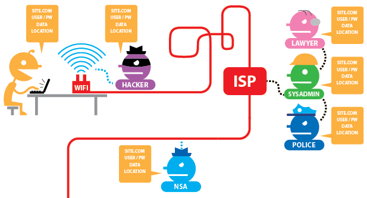
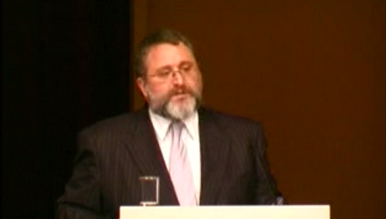

<!-- $theme: gaia -->
# &nbsp;
##### ==[Die Gedanken sind frei](https://en.wikipedia.org/wiki/Die_Gedanken_sind_frei), wer kann sie erraten...==
#### Thoughts are free, who can guess them?
# 
<!-- Section of Tor and HTTPS diagram from https://www.eff.org/pages/tor-and-https -->
##### Session 6 of ==Citizen FOSS== by Sean O'Brien

##### sean@webio.me | sean.obrien@yale.edu

###### 
<!-- Creative Commons Attribution-ShareAlike -->

---
<!-- *template: gaia -->

## This Week:
We're centering the conversation around freedom of speech and the freedom of ideas. Within the modern context of **surveillance** and **network intermediation**, are thoughts actually _libre_?

* The Web is, fundamentally, a system for **reading**.
* The Web was also designed for **writing**.
* We often talk about threats to writing (**speech**).
* Is there a chilling effect on reading (**thought**)?

---
<!-- *template: invert -->
<!-- page_number: false -->

### Die Gedanken Sind Frei:
##### Free Software and the Struggle for Free Thought

# 
<!-- CyberSec101 "Why Privacy Matters" -->
###### [Watch on the Web:arrow_right:](http://www.wizards-of-os.org/archiv/wos_3/programm/panels/opening_keynote/eben_moglen/mp4_hi.html) 
