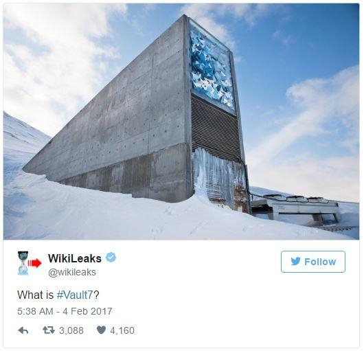
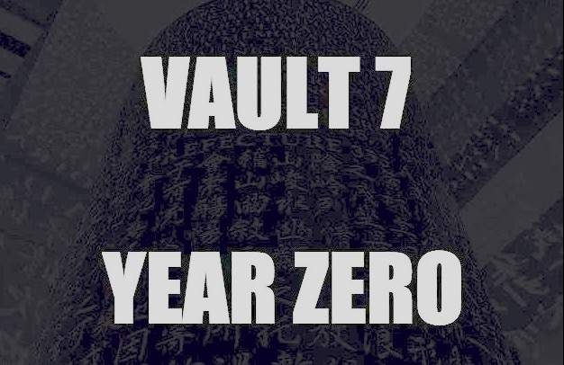

<!-- $theme: gaia -->
<!-- *template: invert -->
<!-- page_number: false -->

# What is ==#Vault7==?
##### A Quick Primer on Part 1: "Year Zero"

# 
<!-- WikiLeaks #Vault7 teaser graphic, with photo of Global Seed Vault in Svalbard, Norway -->

##### March 8, 2017 | Sean O'Brien
###### <small>sean@webio.me | sean.obrien@yale.edu | [secure contact info](https://webio.me/contact) </small>

###### 
<!-- Creative Commons Attribution-ShareAlike -->

---
<!-- *template: invert -->

> Recently, the CIA **lost control** of the majority of its hacking arsenal including malware, viruses, trojans, weaponized 'zero day' exploits, malware remote control systems and associated documentation. This extraordinary collection, which amounts to more than several hundred million lines of code, gives its possessor the entire hacking capacity of the CIA.
>
> The archive appears to have been circulated among former U.S. government hackers and contractors in an unauthorized manner, one of whom [has provided WikiLeaks with portions of the archive](https://wikileaks.org/ciav7p1/).

---
<!-- page_number: true -->

## Before We Begin
<!-- Pluggable Transports icon -->

If you have the Tor Browser Bundle, 
you should probably use it.

[Download TBB:arrow_right:](https://www.torproject.org/projects/torbrowser.html.en)
<small>_It's Firefox, but anonymous! Security plugins pre-installed._</small>

We are **justifiably paranoid** when digging into this material. Consider your [Threat Model](https://blog.yourultimatesecurity.guide/2016/04/threat-modeling-an-introduction/).

* [WL Twitter account](https://twitter.com/wikileaks) is followed by millions. There is still power in crowds, but no longer anonymity.

* Browsing [WikiLeaks.org](https://wikileaks.org) is considered subversive.

---
<!-- page_number: true -->

## The ==#Vault7== archive
<!-- WikiLeaks icon -->

WL has been [teasing this release](http://knowyourmeme.com/memes/events/vault-7-leaks), and has promised [2017 "will blow you away"](https://www.rt.com/news/372550-wikileaks-2017-showdown-leaks/).

* [Part 1 is "Year Zero"](https://wikileaks.org/ciav7p1/), referring to [0-day vulns](https://en.wikipedia.org/wiki/Zero-day_(computing)).

* Released as a 514MB encrypted [7-zip](https://en.wikipedia.org/wiki/7-Zip) file **WikiLeaks-Year-Zero-2017-v1.7z**,  [SHA-256 sum](https://help.ubuntu.com/community/HowToSHA256SUM): <small><small><small>ad5b92d2aeb2443fe292dafe7b80a8c567b925180b0a66ca212910eb253d6431</small></small></small>

* You would need a [BitTorrent](https://transmissionbt.com/help/gtk/2.7x/html/gettingstarted.html) client to download.

* Password is a [JFK quote](https://twitter.com/wikileaks/status/839100031256920064?ref_src=twsrc^tfw).

* **Disclaimer:** I am **NOT** recommending that you download the archive or browse it online.

---
<!-- page_number: true -->

## So, what's in ==Part 1==?
<!-- WikiLeaks "Year Zero" release graphic, with photo of Lingua sculpture at the Washington Convention Center. Was the photo supposed to be the Kryptos sculpture at the CIA? -->

7818 pages with 943 attachments from the CIA's internal [Confluence](https://en.wikipedia.org/wiki/Confluence_(software)) groupware/wiki.  The format is similar to [Intellipedia](https://en.wikipedia.org/wiki/Intellipedia), but specifically for the CIA's devs, sysadmins, [crackers/hackers](http://www.techrepublic.com/blog/it-security/hacker-vs-cracker/).

* Software vulns and cracking tools are often listed in [pretty tables](https://wikileaks.org/ciav7p1/cms/page_13763491.html#efmBJBBJMBJ9BKIBNbBNmBN1BOBBP8BQHBQaBQmBR7BSGBSYBSk).

* No binaries or scripts (CIA malware, etc.) were released, but the archive was passed around long before WL got a copy (late 2016?).

* Usernames, real names, IP addresses, and more [have been redacted](https://wikileaks.org/ciav7p1/#FAQ). 
