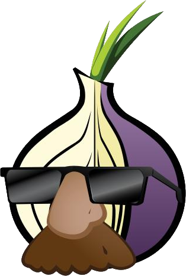

<!-- $theme: gaia -->
<!-- *template: invert -->
<!-- page_number: false -->

# What is ==#Vault7==?
##### A Quick Primer on Part 1: "Year Zero"

# 
<!-- WikiLeaks #Vault7 teaser graphic, with photo of Global Seed Vault in Svalbard, Norway -->

##### March 8, 2017 | Sean O'Brien
###### <small>sean@webio.me | sean.obrien@yale.edu | [secure contact info](https://webio.me/contact) </small>

###### 
<!-- Creative Commons Attribution-ShareAlike -->

---
<!-- *template: invert -->

> Recently, the CIA **lost control** of the majority of its hacking arsenal including malware, viruses, trojans, weaponized 'zero day' exploits, malware remote control systems and associated documentation. This extraordinary collection, which amounts to more than several hundred million lines of code, gives its possessor the entire hacking capacity of the CIA.
>
> The archive appears to have been circulated among former U.S. government hackers and contractors in an unauthorized manner, one of whom [has provided WikiLeaks with portions of the archive](https://wikileaks.org/ciav7p1/).

---
<!-- page_number: true -->

## Before We Begin
<!-- Pluggable Transports icon -->

If you have the Tor Browser Bundle, 
you should probably use it.

[Download TBB:arrow_right:](https://www.torproject.org/projects/torbrowser.html.en)
<small>_It's Firefox, but anonymous! Security plugins pre-installed._</small>

We are **justifiably paranoid** when digging into this material. Consider your [Threat Model](https://blog.yourultimatesecurity.guide/2016/04/threat-modeling-an-introduction/).

* [WL Twitter account](https://twitter.com/wikileaks) is followed by millions. There is still power in crowds, but no longer anonymity.

* Browsing [WikiLeaks.org](https://wikileaks.org) is considered subversive.

---
<!-- page_number: true -->

## The ==#Vault7== archive
<!-- WikiLeaks icon -->

WL has been [teasing this release](http://knowyourmeme.com/memes/events/vault-7-leaks), and has promised [2017 "will blow you away"](https://www.rt.com/news/372550-wikileaks-2017-showdown-leaks/).

* [Part 1 is "Year Zero"](https://wikileaks.org/ciav7p1/), referring to [0-day vulns](https://en.wikipedia.org/wiki/Zero-day_(computing)).

* Released as a 514MB encrypted [7-zip](https://en.wikipedia.org/wiki/7-Zip) file **WikiLeaks-Year-Zero-2017-v1.7z**,  [SHA-256 sum](https://help.ubuntu.com/community/HowToSHA256SUM): <small><small><small>ad5b92d2aeb2443fe292dafe7b80a8c567b925180b0a66ca212910eb253d6431</small></small></small>

* You would need a [BitTorrent](https://transmissionbt.com/help/gtk/2.7x/html/gettingstarted.html) client to download.

* Password is a [JFK quote](https://twitter.com/wikileaks/status/839100031256920064?ref_src=twsrc^tfw).

* **Disclaimer:** I am **NOT** recommending that you download the archive or browse it online.

---
<!-- page_number: true -->

## So, what's in ==Part 1==?
<!-- WikiLeaks "Year Zero" release graphic, with photo of Lingua sculpture at the Washington Convention Center. Was the photo supposed to be the Kryptos sculpture at the CIA? -->

**7818 pages** with **943 attachments** from CIA internal [Confluence](https://en.wikipedia.org/wiki/Confluence_(software)) groupware/wiki.  The format is similar to [Intellipedia](https://en.wikipedia.org/wiki/Intellipedia), but specifically for the CIA's devs, sysadmins, [crackers/hackers](http://www.techrepublic.com/blog/it-security/hacker-vs-cracker/).

* Software vulns, cracking tools, VM are often listed in [pretty tables](https://wikileaks.org/ciav7p1/cms/page_21561399.html).

* No binaries or scripts (CIA malware, etc.) were released, but the archive was passed around long before WL got a copy (late 2016?).

* Usernames, real names, IP addresses, and more [have been redacted](https://wikileaks.org/ciav7p1/#FAQ). 

---
<!-- *template: invert -->
<!-- page_number: false -->

# Feeling ==Surveillance Fatigue==?
## _Better get over it._
# 
<!-- WL tweet -->
### Let's not fall into ==despair== or ==indifference==.
#### WL is just revealing a world we already live in.

---
<!-- page_number: true -->

#### Comparisons, so far...
<!-- Screenshot from Citizenfour -->

### ==The Snowden trove:==
==&bull;== Leaked to a small group of reporters, experts.

==&bull;== Redacted and released as an [intermittent](https://foreignpolicy.com/2013/10/03/a-wikileaks-family-feud-erupts-on-twitter/) series of articles in major news outlets.

==&bull;== [Not all published](https://theintercept.com/2016/08/19/the-nsa-was-hacked-snowden-documents-confirm/), but pace will [likely increase](https://theintercept.com/2016/05/16/the-intercept-is-broadening-access-to-the-snowden-archive-heres-why/).

==&bull;== Revealed [targeted surveillance](https://en.wikipedia.org/wiki/PRISM_(surveillance_program)) on a global scale as well as targeted surveillance, software vulns.

==&bull;== NSA internal training, documentation, & [presentations](https://en.wikipedia.org/wiki/PRISM_(surveillance_program)#The_slides) had the most media impact.

---
<!-- page_number: true -->

### ==#Vault7==:
==&bull;== Circulated by CIA staff/contractors, then shared with WikiLeaks. WL has [redacted content and code](https://wikileaks.org/ciav7p1/#FAQ).

==&bull;== Primary source published in batches, the standard WL approach (indexing, search tools, &amp; highlighting).

==&bull;== "Year Zero" focuses on software exploits, malware. 

==&bull;== So far, much of the  release is CIA internal [training](https://wikileaks.org/ciav7p1/cms/page_14587255.html), [documentation](https://wikileaks.org/ciav7p1/cms/page_2621753.html), [tips &amp; tricks](https://wikileaks.org/ciav7p1/cms/page_26607630.html) for being a spy.

---
<!-- *template: invert -->

#### Are Signal &amp; WhatsApp broken?
<!-- Signal icon -->
There's [no evidence](https://theintercept.com/2017/03/07/the-cia-didnt-break-signal-or-whatsapp-despite-what-youve-heard/) the CIA broke the Signal protocol itself, which WhatsApp also uses. No private chat app, [Telegram](https://t.co/acTMkdl1A7) or any other, has been mentioned as being cracked.

The underlying operating systems iOS and Android [have been pwned](https://wikileaks.org/ciav7p1/#ANALYSIS).  We don't know the full extent of the Android pwnage ([all AOSP](https://en.wikipedia.org/wiki/Android_(operating_system)#Open-source_community)? [just some firmware](https://wikileaks.org/ciav7p1/cms/page_11629096.html)?)

<small>&bull; If your text, audio, and video are being recorded before a private chat app can encrypt them, what's the use?</small>
###### This highlights the importance of controlling, upgrading, and switching your OS.

---
<!-- page_number: true -->

### Is there any good news?
<!-- Person confused about security -->
Encryption curbs ==mass surveillance==.

* <small>Apps like Signal, WhatsApp, and Telegram ==_can_== work **as long as the [implementation is sound](https://www.theguardian.com/technology/2017/jan/16/whatsapp-vulnerability-facebook)**, the **OS is secure**, and **ALL of the source code is open**.</small>

* <small>Some of the CIA malware is [already being stopped](https://twitter.com/wikileaks/status/839526624768962560).</small>

---
<!-- *template: invert -->
<!-- page_number: false -->

## Let's take the CIA's advice and avoid ["Death by PowerPoint"](https://wikileaks.org/ciav7p1/cms/page_26607630.html#efmBLLBLp)

# 
<!-- advice for CIA agents in the Frankfurt Consulate -->

##### Let's skim through a list of  #Vault7 revelations so far, and discuss a few of them.

---
<!-- page_number: true -->

#### ==#Vault7== Part 1, "Year Zero"

* <small>CIA tech espionage has grown massively, its "own NSA" by 2016, the [Center for Cyber Intelligence](https://wikileaks.org/ciav7p1/files/org-chart.png).</small>

* <small>CIA malware [pwns iPhones, iPads](https://wikileaks.org/ciav7p1/cms/space_2359301.html).</small>

* <small>CIA malware [pwns many (most? all?) Android devices](https://wikileaks.org/ciav7p1/cms/space_11763721.html).</small>

* <small>CIA malware [pwns newer Samsung SmartTVs](https://wikileaks.org/ciav7p1/cms/page_12353643.html), spying with camera and microphone while in "Fake-Off".</small>

* <small>CIA can [remotely control motor vehicle computers](https://wikileaks.org/ciav7p1/cms/page_13763790.html), potentially using them in assassinations.</small>

* <small>Apple devices are [disproportionately targeted](https://wikileaks.org/ciav7p1/cms/page_13205587.html), perhaps because of  popularity in powerful social &amp; business circles.</small>

---
<!-- page_number: true -->

#### ==#Vault7== Part 1, "Year Zero"

* <small>CIA [hoards 0-days](https://wikileaks.org/ciav7p1/cms/page_11629096.html), which it has now lost control over.</small>

* <small>CIA has a huge arsenal to [pwn Microsoft Windows](https://wikileaks.org/ciav7p1/cms/page_11628612.html).</small>

* <small>"Hammer Drill" [infects CD/DVDs](https://wikileaks.org/ciav7p1/cms/page_17072172.html) via Windows burning software Nero.</small>

* <small>Other exploits [hide on USB keys](https://wikileaks.org/ciav7p1/cms/page_13762636.html) and on [hard drives](https://wikileaks.org/ciav7p1/cms/page_13763236.html).</small>

* <small>[Network Devices Branch](https://wikileaks.org/ciav7p1/cms/space_15204355.html) attacks Internet infrastructure.</small>

* <small>CIA remotely undermines Web server and SSL/TLS security, creating MITM attacks and [spoofing websites](https://wikileaks.org/ciav7p1/#HIVE).</small>

* <small>Anti-virus software is [almost useless](https://apnews.com/53d65013e05142bc8211dd6f1a6558dd/What-the-CIA-thinks-of-your-anti-virus-program) against CIA malware.</small>

---
<!-- page_number: true -->

#### ==#Vault7== Part 1, "Year Zero"

* <small>The U.S. Consulate in Frankfurt, Germany is the ["Center for Cyber Intelligence Europe"](https://wikileaks.org/ciav7p1/cms/page_20251151.html), used for operations across Europe, Africa, and the Middle East.</small>

* <small>CIA devs discussed what the NSA's ["Equation Group"](https://en.wikipedia.org/wiki/Equation_Group) hackers did wrong, how CIA malware-makers [can do better](https://wikileaks.org/ciav7p1/cms/page_14588809.html).</small>

* <small>CIA re-purposes [exploits from other countries &amp; actors](https://wikileaks.org/ciav7p1/cms/page_2621753.html), keeping a huge library of malware.</small>

* <small>CIA has a library of virtual machine images for remote command and control, including a ["PocketPutin"](https://wikileaks.org/ciav7p1/cms/page_13762636.html).</small>

* <small>Malware is designed to [mimic Russian authorship](https://twitter.com/wikileaks/status/839526624768962560).</small>

* <small>Routers are targeted routinely, [especially Cisco devices](https://twitter.com/wikileaks/status/839467760505733120).</small>

