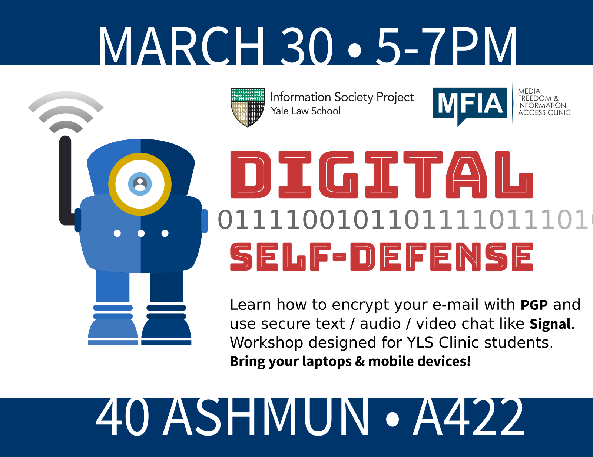
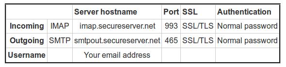
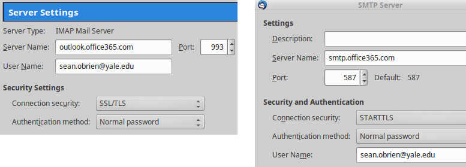
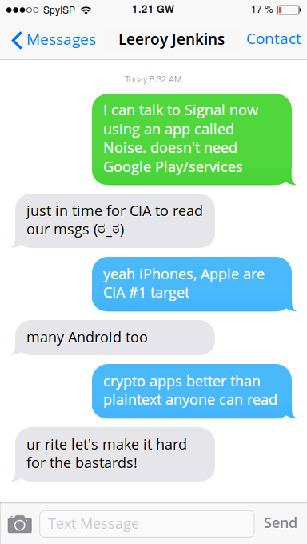

<!-- $theme: gaia -->
<!-- *template: invert -->
<!-- page_number: false -->

# 
<!-- poster with Yale Privacy Lab robot -->

###### Facilitators: [Sean O'Brien](https://webio.me) | Hannah Bloch-Wehba

###### 
<!-- Creative Commons Attribution-ShareAlike -->

---

<!-- page_number: true -->

## These Slides are ==Detailed==
<!-- Rick McCallum explaining "every single image" from the Star Wars prequels -->
Grab a copy of the presentation:
[privacylab.yale.edu/slides/yls-clinics01](https://privacylab.yale.edu/slides/yls-clinics01)

Refer back to it later, read it slowly, &amp; click the links.

* If you don't do everything or fall behind, that's okay. **Learn 3 new things**.

* If you don't have a computer/phone, or it's acting
up, make a friend in the room and follow along.

**==Sharing is Caring:==** Please copy, share, and remix!

---

<!-- *template: gaia -->

## Our Goals Today:

**1.** **Set up PGP-encrypted e-mail (GPG / GnuPG)**
* Manage e-mail via Thunderbird &amp; Enigmail
* Back up and manage our public/private GPG keys.
* Safely share our public GPG key.

**2.** **Browse and share anonymously via Tor**

**3.** **Try mobile apps like Signal / Noise, Kontalk.**

**4.** **Web-based audio/video chat via Jitsi Meet.**

---

<!-- *template: invert -->

## Guiding Principles:

**1.** Trust is earned. Not bought, decreed, or promised.

**2.** [Free and Open Source Software](https://en.wikipedia.org/wiki/The_Free_Software_Definition) (FOSS) is an essential security requirement (not a guarantee).

**3.** Solutions must be both _libre_ &amp; _gratis_ to reduce friction, encourage sharing, avoid discrimination.

**4.** Advertisements &amp; surveillance go hand-in-glove.

**5.** Data is a [toxic asset](https://www.schneier.com/essays/archives/2016/03/data_is_a_toxic_asse.html).

**6.** Centralization is [dangerous](https://techcrunch.com/2016/11/07/signal-app-maker-rebuts-criticism-of-dev-direction-by-calling-for-more-community-help/).

---

<!-- page_number: true -->

# ==Etherpad== for Live Q &amp; A
#### Let's name a new pad at [pad.riseup.net](https://pad.riseup.net/)
###### <small>...this pad will self-destruct in 30 days.</small>

* This is =="Security by Obscurity"==.
<small>**Do not** type info in the pad you wish to remain private.
If the pad name is guessed or shared, anyone can view it.</small>

* [Riseup.net](https://riseup.net/) hosts awesome services.
<small>Donate if you can, they almost had to shut down in 2016.</small>

<small>Other options: [Riseup .onion Etherpad](http://5jp7xtmox6jyoqd5.onion) (Tor only)
[Mozilla's public Etherpad](https://public.etherpad-mozilla.org/) | [Try Ethersheet for spreadsheets](https://ethersheet.org/)</small>

---

<!-- *template: invert -->
<!-- page_number: false -->

# Intro to ==Encryption==
#### How math can keep us secure.
# 
<!-- Encryption -->
###### [Watch on YouTube:arrow_right:](https://www.youtube.com/watch?v=ZghMPWGXexs) 

---
<!-- *template: gaia -->
<!-- page_number: false -->

# Demonstration:
#### Up and running with
# Encrypted E-mail

---

<!-- *template: invert -->
<!-- page_number: false -->

# GPG guide by ==anon108==
##### Uploaded Jan. 6, 2013. Can you name the voice?
# 
<!-- "anon108" video uploaded on 2013-01-06 by Edward Snowden, presumably for Glenn Greenwald (?) to watch -->
###### [Watch on Vimeo:arrow_right:](https://vimeo.com/56881481) 

---

<!-- page_number: true -->

<!-- Mozilla Thunderbird logo -->
#### You Down with ==PGP==? ***Yeah, GnuPG!***

<small>We say "GPG" because we're using the **==G==NU ==P==rivacy ==G==uard** implementation of **==P==retty ==G==ood ==P==rivacy**.</small>

**[Download Thunderbird:arrow_right:](https://www.mozilla.org/en-US/thunderbird/)**

**Follow the EFF's guide for your operating system:**

**[GNU/Linux](https://ssd.eff.org/en/module/how-use-pgp-linux)** | **[MacOS](https://ssd.eff.org/en/module/how-use-pgp-mac-os-x)** | **[Windows](https://ssd.eff.org/en/module/how-use-pgp-windows)**

* You can use your existing e-mail account.

* Configuration guidance on the next slide.

---
### Find your ==IMAP== &amp; ==SMTP== settings

* <small>Thunderbird will guess settings for big hosts like Gmail.</small>

* <small>[**@ylsclinics.org** settings](https://www.godaddy.com/help/thunderbird-set-up-email-4878):</small>

* <small>**@yale.edu** settings:</small>

---
##### ==Answers== to Common Questions

* <small>==Metadata== such as e-mail headers, [DKIM signatures](https://www.wikileaks.org/DKIM-Verification.html), and message Subject are **not private**.</small>

* <small>You use ==your friend's **public** key== to encrypt for your friend. Your friend uses ==your **public** key== to encrypt for you.</small>

* <small>You may publish your **public** key to the [public keyservers](https://pgp.mit.edu/), attach it to an e-mail to your friend, use sneakernet, or try ==OnionShare== &amp; ==Up1== over Tor (more on this later!).</small>

* <small>Your **private** key &amp; ==revocation certificate== should be stored in safe places, separately, perhaps even CD/DVD and paper.</small>

* <small>If you lose your **private key**, you lose messages encrypted with it. The public key will [live forever](http://www.rossde.com/PGP/pgp_keyserv.html#noremove) on the keyservers.</small>

---
##### More Answers, ==Tips &amp; Tricks== 

* <small>You should [turn off HTML in your e-mail](https://securityinabox.org/en/guide/thunderbird/linux/).</small>

* <small>Use the [Key Management](https://enigmail.wiki/Key_Management) dialog to change your key settings ([identity](https://enigmail.wiki/Key_Management#Specifying_additional_user_IDs) / e-mail accounts associated with it).</small>

* <small>Use ==Key Management== to [sign keys of your contacts](https://en.wikipedia.org/wiki/Key_signing_party), set the trust level of keys, and set [per-recipient rules](https://enigmail.wiki/Configuration#Per-Recipient_Rules).</small>

* <small>Use ==Key Management== to [back up your key pair](https://enigmail.wiki/Key_Management#Making_a_backup_of_your_key_pair), generate a revocation cert, and download missing keys for contacts.</small>

* <small>In your  ==Account Settings== make sure your Draft and Trash messages are stored in local folders.</small>

---
##### Even ==More Tips==!!!!!!111

* <small>To encrypt attachments, you must use PGP/MIME (the default). If you have issues with this, [turn it on and off](https://enigmail.wiki/Signature_and_Encryption#Account_settings).</small>

* <small>GPG messages can't be checked by server anti-virus.  This may result in "UNCHECKED" being appended to the subject by the e-mail server.  If so, set [Inline PGP](https://enigmail.wiki/FAQ#What.27s_the_difference_between_Inline_PGP_and_PGP.2FMIME.3F) as default.</small>

* <small>You should use GPG to verify identity by [signing messages](https://support.mozilla.org/t5/Privacy-and-security-settings/Digitally-Signing-and-Encrypting-Messages/ta-p/16330).</small>

**==If all else fails==**, you can manually encrypt the message and copy/paste into the e-mail body, [like Snowden in this video](https://vimeo.com/56881481).  Use [GNU Privacy Assistant](https://www.gnupg.org/related_software/gpa/).</small>

---
### Options for ==Other E-mail Clients==

* **Apple Mail:** You can use the [GPG Suite](https://gpgtools.org/). Your mileage may vary, and Apple Mail + GPG has a [very rocky history](https://gpgtools.org/).

* **MS Outlook:** You can use [Gpg4win](https://www.gpg4win.org/features.html) and the GpgOL plugin for Outlook.

* **Android:** Install [F-Droid](https://f-droid.org/) and use [K9-Mail](https://k9mail.github.io/download.html) + [APG](https://f-droid.org/repository/browse/?fdfilter=apg&fdpage=1&page_id=0).

* **iOS:** [iPGMail](https://ipgmail.com) and [oPenGP](https://itunes.apple.com/us/app/opengp/id414003727?mt=8) are your best options, though they are not *libre* or *gratis*.

---
<!-- page_number: true -->

## Making ==First Contact==
<!-- Spiderman meme -->
##### Establishing a trusted connection

Privacy tools require ==trust== and a ==shared secret==. That secret could be a username, a
URL, a passphrase, or an encryption key.

* <small>Share a secret using tools you learn about today.</small>

* <small>Meeting in person may be the best method.</small>

* <small>[Etherpads](https://pad.riseup.net/), pastebins/imagebins like [Up1](https://pad.riseup.net/), and
"burner" temporary e-mail accounts are good options.</small>

<small>Try to use ==Tor Browser== or ==Orfox== for first contact 
_(we'll cover this later)_.</small>

---

<!-- *template: invert -->
<!-- page_number: false -->

# Onion Routing via ==Tor==
#### Be truly anonymous on the Internet.
# 
<!-- Tor Project -->
###### [Watch on YouTube:arrow_right:](https://www.youtube.com/watch?v=JWII85UlzKw) 

---
<!-- *template: gaia -->
<!-- page_number: false -->

# Demonstration:
#### Try out
# [Tor Browser Bundle](https://www.torproject.org/projects/torbrowser.html.en)

---

<!-- page_number: true -->

## ==Anonymous== Web Browsing
<!-- Pluggable Transports icon -->

We'll use Tor to share secrets, GPG keys.

[Download Tor Browser Bundle:arrow_right:](https://www.torproject.org/projects/torbrowser.html.en)
<small>_It's Firefox, but anonymous! Security plugins pre-installed._</small>

[Download OnionShare:arrow_right:](https://onionshare.org)
<small>_Creates a temp Tor hidden service (.onion address)_</small>
<small>_for sharing files/folders with other Tor users._</small>

[6zc6sejeho3fwrd4.onion](http://6zc6sejeho3fwrd4.onion/) <small>_Up1 filesharing and pastebin._</small>
<small>_[share.riseup.net](https://share.riseup.net) in a non-Tor browser._</small>

[Onion Sites That Don't Suck](https://github.com/alecmuffett/onion-sites-that-dont-suck)

---

<!-- page_number: true -->

## ==Tor== anonymity is the gold standard

The Tor network thwarts the NSA's best efforts to
break it (we know this [thanks to Snowden](https://www.theguardian.com/world/interactive/2013/oct/04/tor-stinks-nsa-presentation-document)).

* <small>**==However:==** Using Tor is not a magic bullet. Vulnerabilities may occur over time, so  **update often** (TBB will nag you!)</small>

* <small>**TBB Settings:** Go with the defaults. Customization makes you more susceptible  to [browser fingerprinting](https://panopticlick.eff.org/).</small>

* <small>**Bridges:** [Use if Tor is blocked](https://www.torproject.org/docs/bridges#AddTorNotWorks) or you need extra protection.</small>

---
<!-- *template: gaia -->
<!-- page_number: true -->

### 
<!-- convo about Signal, Noise, #Vault7 -->

---
<!-- *template: invert -->

#### Did [#Vault7](https://wikileaks.org/ciav7p1/) break Signal &amp; WhatsApp?
<!-- Signal icon -->
There's [no evidence](https://theintercept.com/2017/03/07/the-cia-didnt-break-signal-or-whatsapp-despite-what-youve-heard/) the CIA broke the Signal protocol itself, which WhatsApp also uses. No private chat app, [Telegram](https://t.co/acTMkdl1A7) or any other, has been mentioned as being cracked.

The underlying operating systems iOS and Android [have been pwned](https://wikileaks.org/ciav7p1/#ANALYSIS).  We don't know the full extent of the Android pwnage ([all AOSP](https://en.wikipedia.org/wiki/Android_(operating_system)#Open-source_community)? [just some firmware](https://wikileaks.org/ciav7p1/cms/page_11629096.html)?)

<small>&bull; If your text, audio, and video are being recorded before a private chat app can encrypt them, what's the use?</small>
###### This highlights the importance of controlling, upgrading, and [switching your OS](https://copperhead.co/android/).

---
<!-- page_number: true -->

#### ==Mobile== Devices

**iPhones/iPads:** The proprietary software in these is a security liability. Also, the CIA [disproportionately targets](https://wikileaks.org/ciav7p1/cms/page_13205587.html) Apple devices.  ==**Covering some Threat Models is better than being wide open.**==

**Android:** For similar reasons, stock firmware is vulnerable. Especially Samsung, popular models.

**Everyone:** Your current device may not allow you to "free" it.  ==Keep freedom in mind== for your next device.

**iOS users** should focus on installing [Signal](https://whispersystems.org/), which is like a more-trustworthy version of WhatsApp.

---

<!-- F-Droid logo -->
### ==Android== Recommendations

* <small>Install [F-Droid](https://f-droid.org/).  This is an app store with ==only free software==.</small>

* <small> Add the [Copperhead OS F-Droid repository](https://copperhead.co/android/docs/usage_guide) in F-Droid and install ==Noise== (Signal without the Google dependency).</small>

* <small> [Add the Guardian Project repository](https://guardianproject.info/fdroid/) in F-Droid. GP offers privacy apps like [ObscuraCam](https://guardianproject.info/apps/obscuracam/).</small>

* <small> Try [Orfox](https://onionshare.org/) and [OrWall](https://orwall.org/) for Tor browsing.</small>

* <small> Install [Silence](https://silence.im/) for encrypted SMS and MMS texts.</small>

* <small> Try [Kontalk](https://kontalk.org/) for a **decentralized** alternative to Signal/Noise.</small>

---
<!-- *template: gaia -->
<!-- page_number: false -->

# Demonstration:
#### Hands‐on with
# [Jitsi Meet](https://meet.jit.si/)

---
<!-- page_number: true -->

# Secure ==Audio/Video Chat==
#### Let's name a new room at [https://meet.jit.si](https://meet.jit.si/)
###### <small>...this chat room will self‐destruct when everyone leaves.</small>

<!-- Muppets using Jitsi Meet -->
* <small>[Peer-to-Peer](https://en.wikipedia.org/wiki/Peer-to-peer) and 
[End-to-End Encryption](https://en.wikipedia.org/wiki/End-to-end_encryption)</small>

* <small>Password-protected rooms, no user limit, screen sharing</small>

* <small>Built-in Etherpad, text chat, optional [YouTube streaming](https://jitsi.org/Projects/YouTubeLive)</small>

Other ==WebRTC== options: [appear.in](https://appear.in/) | [Talky](https://talky.io/)

---

<!-- *template: invert -->
<!-- page_number: false -->

### Secure Comms Strategy<!-- The portable cone of silence from Get Smart -->
#### Make a plan and stick to it.
* <small>The **What**: Choose a few crypto, sharing, &amp; publishing tools.</small>
* <small>The **How**: Try these tools, figure out how they work.</small>
* <small>The **Where**: Find safe places to share secrets, on &amp; offline.</small>
* <small>The **When**: Describe scenarios when you will use each tool.</small>
* <small>The **Why**: State clear reasons to use each tool.</small>
* <small>The **Who**: Identify "experts" who can help &amp; teach others.</small>

<small>**The Only Constant Is Change!** Try new software, keep up on tech news &amp; potential threats, and re-evaluate over time.</small>

---

<!-- page_number: false -->

## Resources
<!-- Debian apt-get install anarchism -->
* Free Software Foundation: [fsf.org](https://fsf.org/)
* Tor Project: [torproject.org](https://torproject.org/)
* Electronic Frontier Foundation: [eff.org](https://eff.org/)
* [Digital Security For Journalists](https://www.gitbook.com/book/susanemcg/digital-security-for-journalists/details)

[Cryptoparty](http://www.cryptoparty.in) | [Riseup](https://help.riseup.net/en/security) | [Tactical Tech](https://tacticaltech.org/security-box) | [PRISM Break](https://prism-break.org)

[MayFirst](https://support.mayfirst.org/wiki/how-to) | [Encryption Works](https://freedom.press/encryption-works) | [Reset The Net](https://pack.resetthenet.org/)

[Digital First Aid](https://www.digitaldefenders.org/digitalfirstaid/) | [H-Node](https://h-node.org) | [DRM-Free](https://www.defectivebydesign.org/guide)

**[Digital Security Helpline](https://www.accessnow.org/help)**: 24/7 multilingual support

**[Xnet](https://xnet-x.net/contactanos-para/publicaciones/)**: grandes recursos en español
